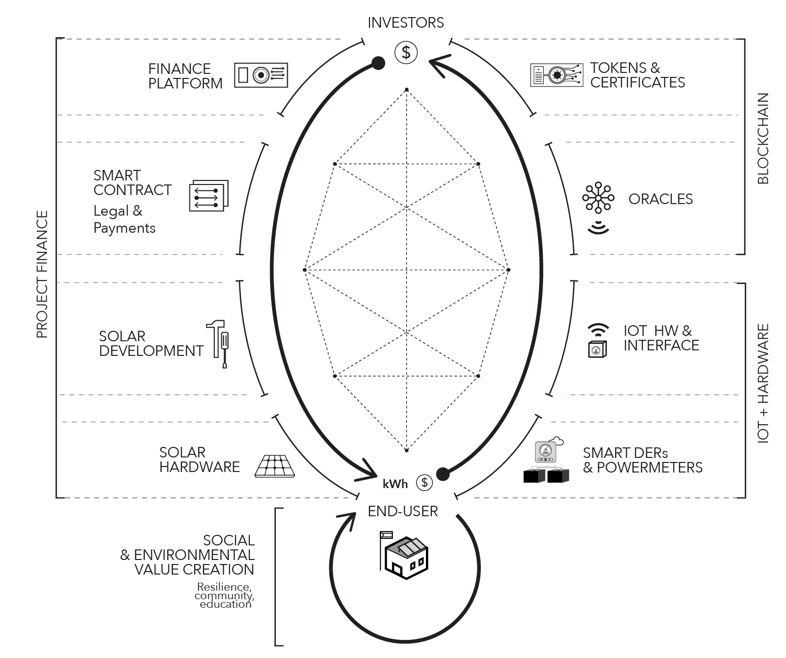
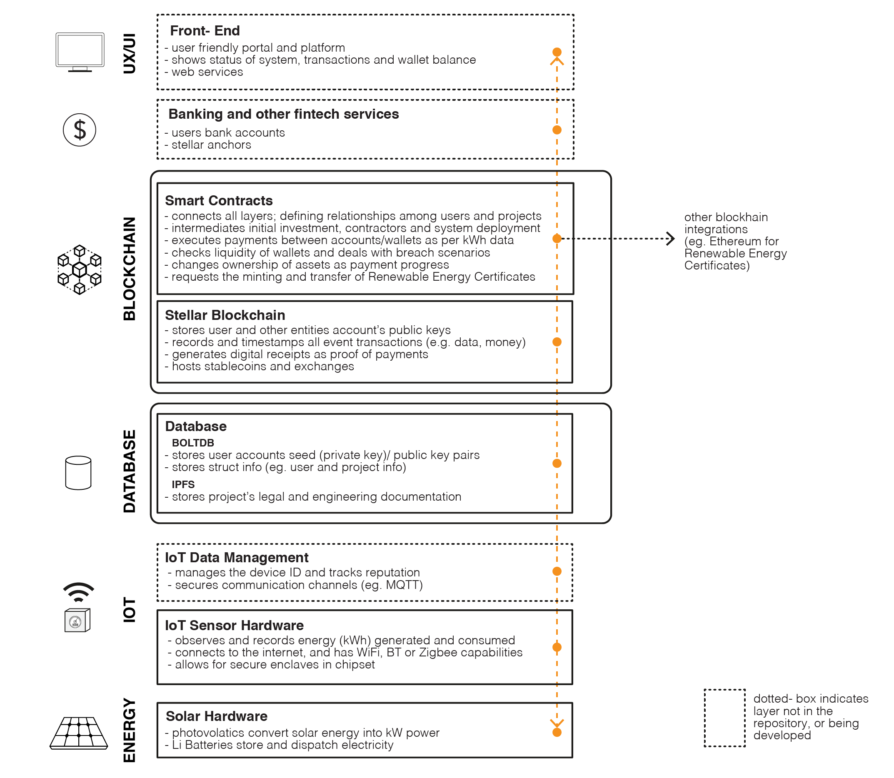
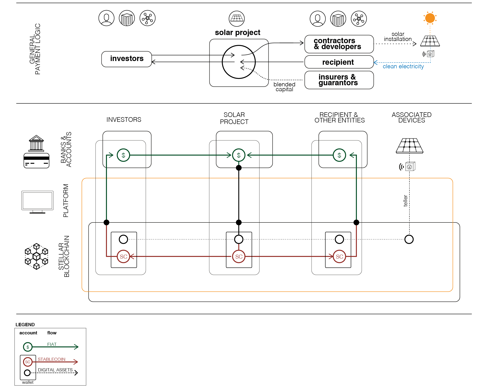
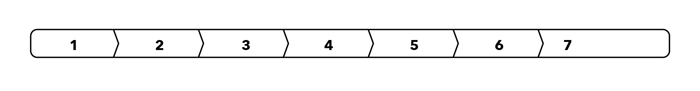

# OpenSolar

  

Opensolar is a platform built on openx for financing smart solar infrastructure using the Stellar blockchain. Opensolar uses IoT devices, smart meters and smart contracts to automate the end-end payments flow, making moving money cheaper and faster. Work in Progress.

#### ABSTRACT

The OpenSolar Project and platform aims to use blockchain and IoT based smart contracts to help finance community solar projects. We seek to develop open source core technology to streamline the flow of crowd-based funds (eg. muni bonds and equity crowds) to finance the deployment of solar assets, and allow the end-users to own these resources in a short time frame through regular utility-like payments driven by energy generation and consumption IoT data.

The payment platform defaults to using the Stellar blockchain, and our pilot projects are done in public schools in Puerto Rico. Projects can choose to be hosted on different chains as well.

# Introduction

#### BACKGROUND & CONTEXT
The project was originally focused on transactive community microgrids and initiated at the [Digital Currency Initiative](https://dci.mit.edu/) of the MIT Media Lab. The [Yale Openlab](https://openlab.yale.edu) and the DCI then joined efforts and this shifted to a more finance based focus. [First prototypes](https://github.com/YaleOpenLab/smartPropertyMVP) were built using the Ethereum blockchain and presented at the MIT Media Lab's 2018 Members Weeks Demo .

#### PUERTO RICO'S PUBLIC SCHOOLS AND EMERGENCY SHELTERS
This project has been deeply inspired by the situation facing Puerto Rico, and has focused its first deployment and pilots efforts on the island's schools.
One year after hurricane Maria hit the island, schools are still exposed to a centralized and high-carbon energy system vulnerable to climate impacts. At the same time, schools and their communities are becoming social nodes, and the Puerto Rican government and the Department of Education are working to appoint schools as emergency shelters —nodes with robust energy and communication systems— for the community to reach out in the event of unavoidable climate shocks. Financing the infrastructure for this is a key gap. The platform is being built to structure peer-to-peer solar finance and payments mechanisms to address this funding gap, and in the process replace the now outdated power payment agreement (PPA) model for residential and commercial solar, with an adaptive and data-driven pay-to-own model.

# Platform System and Code Architecture
The sections below explain key components of how this project is being built.

#### MAIN SMART SOLAR CONTRACT IDEA
Investors can finance solar photovoltaic systems around the world with several layers to de-risk their investment and certify the project's social and environmental value. End-users (or 'recipients') can receive the solar systems with no downpayment, pay for the energy per kWh just like they do with the current utility, but once they pay off the cost of the system plus a low interest (i.e. a return to investors), they will fully and legally own the system (zero energy cost thereafter).

The first financial investment model considered here is that of the issuance of a municipality bond as the debt instrument. Other models include equity crowd-funding and normal crowdfunding. With the municipal bond, the issuer (eg. end-user) issues a bond through a platform (eg. neighborly), and the investors buy enough bonds (at different values) to cover the principal (i.e. capex) of the solar system. The smart solar contract will organise bidding processes with contractors (i.e. solar developers), pay out contractors and inform when the system is 'live'.

Different layers of IoT energy monitoring devices inform of the energy generated by the solar system and the energy consumed by the end-user. This energy data (eventually using an oracle as intermediary) activates payment transactions per kWh at a specified tariff rate (e.g. also using an oracle to determine the normal tariff) and at specific intervals (eg. monthly). Energy payment transactions occur between the recipient/end-user's wallet/account and a main escrow smart contract that accrues the funds and issues payment of interests (i.e. coupons) to investors. Once the accrued funds can cover the original principle, the contracts pays off investors and the bonds matures.

Other relevant contract layers include risk mitigation processes to deal with payment breaches (i.e. end-user doesn't pay for energy), and the issuance/minting of Renewable Energy and Carbon Certificates based on the kWh energy reported by the IoT devices.

#### STACK LAYOUT
The full open source stack needs to cover all layers, from the energy and IoT hardware through the blockchain and into the front-end and user experience.

### PAYMENT ARCHITECTURE USING STELLAR
The diagram below explains the general payment logic between investors, recipients and other project entities. The payment architecture of this is built on the Stellar blockchain which enables fiat and stablecoin interactions, and digital assets (explained below) that act as proof of payment or debt and can be fungible. The integration of the IoT devices (eg. the powermeter) is what drives payments once the project is fully deployed.

#### Digital Assets on Stellar
Stellar has some design tradeoffs compared to Ethereum, especially with regard to the concept of "state" in Ethereum.

Stellar doesn't support a Turing complete VM like Ethereum nor a stack based system like Bitcoin. Instead, it provides a standard set of operations which are decided on the protocol level and offers SDKs to build upon the platform. While limited in function, stellar possesses powerful fundamentals which could be used to partially replicate the notion of state in Ethereum.

One of the core features of stellar is the creation of [Assets](https://www.stellar.org/developers/guides/concepts/assets.html). An Asset is anything that can be issued by a party to track ownership or provide proofs of investment / debt, etc.

In this prototype, we use these (Digital) Assets to track multiple things:

1. Investment in a particular asset: When a person invests say 2000 USD in a project, she needs some sort of irreversible proof that she has invested in that particular project. This would ideally be just stored in a variable if using Ethereum. But with Stellar, we issue an asset called "Investor Asset" once an investor invests in a particular project. This investor asset is issued 1:1 with the amount of eg. USD invested, meaning an investor who invests 2000 USD as explained above would get 2000 Investor Assets in return. The Investor Asset is pseudo-unique (more on this to follow) and can be tracked with the help of the 12 character identifier that stellar provides us with.

NOTE: Stellar limits the character limit of each asset to 12 characters, so the identifier is not unique. In the case collisions arise, the project ID, Debt Assets and time of creation can be used to identify the asset. There seems to be no workaround for this limit, so we are forced to go ahead with this scheme.

2. When a project has reached its target goal in USD, we need to assure investors that their amount invested in the project is reflected in the form of debt. For this, we issue "Recipient Assets" which denote that the recipient of the funds officially owes its amount (plus a set interest). Like the Investor Asset, this is 1:1 with the amount invested.

3. Once a project has been installed and can generate electricity, the recipient starts to pay back towards the project based on what the IoT powermeter reports. After confirmation of each payment, we issue a Payback Asset, which is proportional to the monthly payment bill. This provides ease of accounting and quick look back on whether the recipient is not defaulting on its payments.

For more notions of state and ownership, we can continue to issue relevant assets which would track ownership and history.

Apart from ownership, the assets above serve other functions  that are useful:

1. Investor Assets are tradable: Since the investor asset is a proof of investment in a particular project, we can trade them for other investor assets like traditional property markets or we could use them to trade with USD / take a loan against this asset similar to a secondary mortgage market.

2. Parties that are willing to donate to a particular recipient can choose to payback their electricity bill on their behalf or choose to buy some of their Recipient Assets in order to hedge some risk on behalf of them. This is useful to introduce guarantors, which can protect investors in a breach scenario, and thus 'blend' the capital (ie. profit vs impact focus) by taking on the risk. This can also help big charitable organizations which invest in multiple projects, and who need to keep track of their donations in an easy way and provide publicly auditable proof of their donation towards a charity.

#### IPFS and solar project documentation
While dealing with real world entities, we are inevitably faced with dealing with legal contracts. The platform should not worry about what's in the contract as long as it has been agreed to and vetted by both parties, so we store the contract in ipfs and commit the resulting hash in two split stellar transactions' memo fields. The memo field of stellar can only hold 28 characters, so we split the 46 character ipfs hash into two parts and pad the second hash with characters to denote that it is an ipfs hash and not some garbage value. This ipfs hash has to be checked on all parties' ends to ensure that this is the same contract that they agreed to earlier

### ENTITIES, PROJECTS & SMART CONTRACTS
There are various users and entities defined in the code (and more on the way), which cater to the different functions performed by entities in the real world:
 - PLATFORM- the platform is the server on which the projects are advertised on, and where the smart contracts that define the actor relationships are set. (i.e. OpenSolar)
 - INVESTOR - the investor is a person / organisation who invest in a particular project
 - RECIPIENT - the recipient is the person / organisation / coop which receives the solar system and will then make payments to acquire it. It is often the end-user of the electricity and the legal owner of the land in which the project is developed. Additionally, in the case of a municipal bond, the recipient is often the 'issuer' of the debt instrument.
 - ORIGINATOR - the person/organisation who proposes a pre-origin contract to a recipient and requires approval from the recipient to initiate the project through its stages of development.
 - CONTRACTOR - all entities that provide services to the project and receive payments for these services. This includes consultants, lawyers, hardware providers/retailers, engineers etc. Some engineers can be contracted to solely prepare the technical aspects of a tender or RFP (request for proposal), to which other developers will bid for.
 - DEVELOPER - the contractors who is responsible for installing the hardware, makes sure the solar panels and IoT devices work accordingly. These often require a post-installation guarantee.
 - GUARANTOR - the person/organisation who is insuring funds that will protect investors in the case of a delayed payment from the recipient's side

#### PROJECT STAGES

 Each solar system deployment is defined as a "Project" and a given project has specific stages with activities that have to be completed before moving on to the next stage. The various stages and their definition can be found in `core`

A rough path taken by a specific project would be:
1. Originator(s) approaches recipient with an idea for using a space owned by the recipient to start a new project.
2. Recipient reviews all received proposals and chooses a specific one. An MOU is commonly agreed upon by both the originator and the recipient.
3. Recipient promotes the project from stage 0 to stage 1, hence opening the project for proposals from contractors. If seed funding is desired, he promotes the contract to stage 1.5, asking investors to invest in the seed stage.
4. Contractors view all originated projects and put out proposals for working with specific projects. A given project may have multiple contractors performing different roles in the system.
5. At this stage, investors can see all proposed projects and van vote on them, giving reviewing recipients a chance at which proposal would get the most funding.
6. Recipient views all the proposed contracts by various contractors and chooses a specific one to open to investor funding. It promotes the project from stage 2 to stage 3.
7. Investors view all contracts open to funding and choose to invest in them. They get Investor Assets in return.
8. Once the funding goal is reached, the platform hands out Recipient Assets and Payback Assets to the Recipient and the Contractor is expected to start working as per previously proposed contract. The project's stage is upgraded from stage 3 to stage 4.
9. Once installation is complete, the contractor promotes the project from stage 4 to stage 5.
10. Power generation is tested. If the installation works fine, the project's stage is upgraded from stage 5 to stage 6 and the recipient pays back an amount based on electricity consumption with inputs from the energy oracle.
11. Once the paid amount matches that agreed upon in the contract, ownership of the installed system is granted to the recipient. The Project's stage is upgraded from stage 6 to stage 7.

# LICENSE
[GPL3](https://github.com/YaleOpenLab/opensolar/blob/master/LICENSE)
